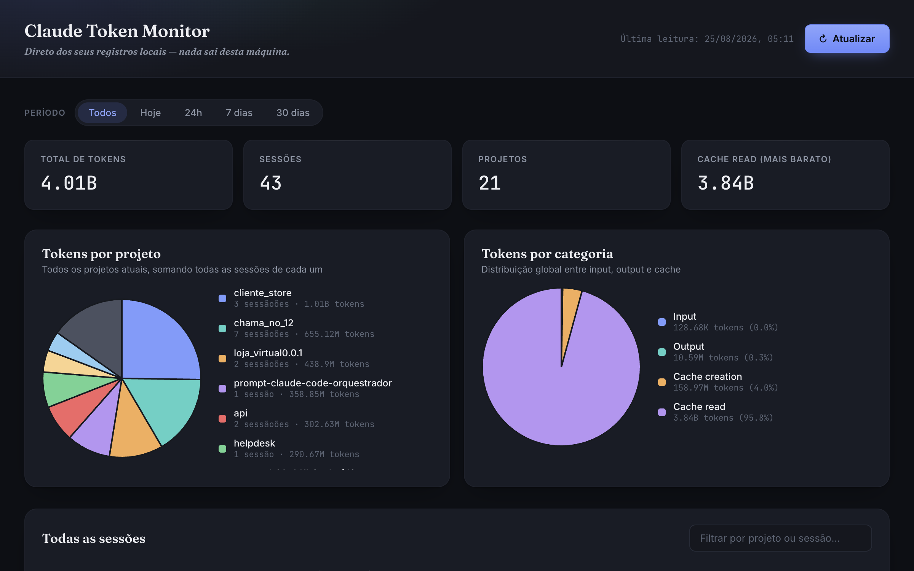

# Claude Token Monitor

App desktop (Electron) que lê os registros locais do **Claude Code**
(`~/.claude/projects/**/*.jsonl`) e mostra, em gráficos e tabela, quanto de
token cada sessão/projeto consumiu — 100% local, 100% offline, zero dado
saindo da máquina.

> Repositório pensado como estudo de caso técnico: além do app em si, a
> seção [Decisões de engenharia](#decisões-de-engenharia) explica **por que**
> cada escolha foi feita, não só o que foi implementado.

**Download**: [última release](https://github.com/morgadothiago/claude-token-monitor/releases/latest) (macOS, Windows, Linux)



---

## O problema que resolve

Quem usa o Claude Code no dia a dia não tem visibilidade nenhuma de quanto
token cada sessão/projeto consumiu ao longo do tempo — essa informação fica
espalhada em dezenas de arquivos `.jsonl` (um por sessão) dentro de
`~/.claude/projects/`. Este app varre esses arquivos, agrega os números e
mostra de forma visual, sem exigir nenhuma conta, login ou chamada de rede.

Uma decisão de escopo deliberada: o app **não tenta estimar o limite do seu
plano Pro/Max** nem quando ele "reseta". Não existe API pública da Anthropic
pra isso, e simular ou inventar esse número seria enganar quem usa o app. O
foco é 100% visualização de consumo histórico real.

## Stack e por quê

| Camada | Escolha | Por quê |
|---|---|---|
| Runtime desktop | Electron | Multiplataforma (Win/Mac/Linux) com um único código, acesso a `fs` no main process |
| Renderer | Vanilla JS + CSS | App pequeno, uma tela; React/Tailwind/shadcn foi avaliado e descartado conscientemente — ver [nota abaixo](#por-que-não-react--shadcnui) |
| Gráficos | Chart.js | Instalado via npm e bundlado localmente (sem CDN) — funciona 100% offline |
| Tipografia | `@fontsource` (Fraunces, Inter, JetBrains Mono) | Fontes próprias bundladas localmente, mesma lógica do Chart.js — sem Google Fonts, sem CDN |
| Empacotamento | electron-builder | dmg/zip (macOS), NSIS (Windows), AppImage (Linux) |
| Auto-update | electron-updater | Aponta pra GitHub Releases deste repo |
| Logging | electron-log | Arquivo local por SO, nunca remoto |
| Testes | `node:test` (nativo) | Sem dependência de framework de teste pra lógica pura |
| CI/CD | GitHub Actions | Testes em push/PR, build+release nos 3 SOs nativos ao criar uma tag |

## Arquitetura

```
┌─────────────────────┐        IPC (contextBridge)        ┌──────────────────────┐
│   Renderer process    │ ───────────────────────────────► │    Main process        │
│  (renderer/*.js/html)  │ ◄─────────────────────────────── │  (main.js)             │
│  - Chart.js            │      tokenMonitorAPI.scanSessions │  - ipcMain.handle      │
│  - DOM puro, sem        │                                   │  - lib/scanner.js       │
│    framework            │                                   │    (lógica testável,   │
└─────────────────────┘                                    │     sem depender do    │
         ▲                                                    │     Electron em si)    │
         │ contextIsolation: true                             └──────────┬───────────┘
         │ nodeIntegration: false                                        │
         │ sandbox: true                                                 ▼
┌─────────────────────┐                                    ┌──────────────────────┐
│    preload.js          │                                    │  ~/.claude/projects/   │
│  única ponte exposta    │                                    │  **/*.jsonl (NDJSON)   │
│  via contextBridge      │                                    │  gravados pelo         │
└─────────────────────┘                                    │  Claude Code            │
                                                              └──────────────────────┘
```

- **`main.js`** — bootstrap do Electron (janela, single-instance lock,
  persistência de bounds, IPC, auto-update, logging). Não contém lógica de
  negócio.
- **`lib/scanner.js`** — toda a lógica de varredura/agregação, deliberadamente
  **sem importar `electron`**, pra poder rodar em testes unitários puros com
  `node --test`, sem precisar subir um `BrowserWindow`.
- **`lib/windowState.js`** — persistência de tamanho/posição da janela em
  disco (JSON simples, sem depender de `electron-store`), também livre de
  `electron` e testável isoladamente.
- **`preload.js`** — única porta de entrada do renderer pro mundo Node/Electron,
  expõe uma função (`scanSessions`), nada mais.
- **`renderer/logic.js`** — formatação, filtro, ordenação e agregação usados
  pela UI: funções puras, sem tocar no DOM. Carregado como `<script>` comum
  no browser (expõe `window.CTMLogic`) e também via `require()` direto nos
  testes — mesmo arquivo, sem bundler, sem duplicar lógica.
- **`renderer/renderer.js`** — o único arquivo com DOM/eventos/Chart.js;
  consome `CTMLogic` e a API exposta pelo preload via `window.tokenMonitorAPI`.

## Decisões de engenharia

### Segurança (o que mais importa em Electron)

Electron expõe Node.js num contexto de browser — a superfície de ataque real
é o renderer rodando conteúdo (mesmo que só local). Este projeto segue o
checklist que qualquer review sério de Electron cobra:

- `contextIsolation: true`, `nodeIntegration: false`, `sandbox: true` em
  todas as janelas.
- Única ponte renderer↔Node é o `preload.js`, via `contextBridge`, expondo
  **uma função read-only** (`scanSessions`) — o renderer não tem acesso a
  `fs`, `require`, nem a nenhuma API do Node.
- CSP restritiva no `index.html` (`script-src 'self'`) — nenhum script
  externo consegue rodar, nem por engano.
- `webContents.setWindowOpenHandler` e `will-navigate` bloqueados pra
  qualquer origem que não seja `file://` — defesa em profundidade contra
  navegação/pop-up indesejado.
- Streaming (`readline` + `fs.createReadStream`) em vez de
  `readFileSync` + `JSON.parse` do arquivo inteiro — os `.jsonl` do Claude
  Code podem ser grandes, e isso evita travar o main process.

### Por que não React + shadcn/ui

Foi uma decisão consciente, não desconhecimento da stack. Pra uma tela única
sem fluxos de formulário/modal complexos, o ganho de produtividade de
React+Tailwind+shadcn não paga o custo de montar todo o pipeline de build
(Vite/electron-vite) só pra isso. Vanilla JS bem organizado (funções puras de
render, um único objeto de estado, sem frameworks reativos) resolve o
problema com menos superfície de manutenção. Fica documentado aqui porque é
exatamente o tipo de trade-off que se espera justificar numa decisão técnica
real.

### Testabilidade

Tanto a lógica do main process (`lib/scanner.js`, `lib/windowState.js`)
quanto a lógica de UI (`renderer/logic.js`) são deliberadamente livres de
`electron`/DOM, então rodam em testes unitários puros com `node --test` —
sem precisar subir um `BrowserWindow` nem simular um DOM (jsdom). 32 testes
no total, cobrindo:

- parsing de linha NDJSON malformada sem derrubar o scan inteiro;
- soma de categorias de token com campos ausentes;
- agregação por projeto e por sessão, ordenação, filtro por período/texto;
- persistência de bounds da janela (round-trip, arquivo corrompido, valores
  absurdos);
- um teste de integração real, criando arquivos `.jsonl` temporários em
  disco e rodando o `scanSessions()` fim a fim.

```bash
npm test
```

### Outros detalhes de robustez

- **Single-instance lock** (`app.requestSingleInstanceLock()`) — abrir o app
  de novo só foca a janela existente, em vez de subir uma segunda instância
  escaneando os mesmos arquivos em paralelo.
- **Tamanho/posição da janela persistidos** entre execuções (`lib/windowState.js`).
- **Tabela renderizada incrementalmente** (`TABLE_PAGE_SIZE = 50` +
  botão "Carregar mais") em vez de criar uma `<tr>` por sessão de uma vez só
  — importa pouco com dezenas de sessões, mas evita degradação num histórico
  de anos de uso.

## Rodar localmente

```bash
npm install
npm start
```

## Build / distribuição

```bash
npm run dist:mac     # dmg + zip, arm64 + x64
npm run dist:linux   # AppImage
npm run dist:win     # instalador NSIS
npm run dist         # os três de uma vez
```

Os instaladores saem em `dist/` (as pastas `*-unpacked` são só estágio
intermediário do `electron-builder`, não é o artefato final). Ícone próprio
em `build/icon.{icns,ico,png}`, gerado a partir de um SVG desenhado do zero
(`scripts/icon-design.html` → `scripts/generate-icon.js` /
`scripts/build-ico.js`) — sem depender de nenhuma ferramenta de design
externa.

### CI/CD

- **`.github/workflows/ci.yml`** — roda `npm test` em Node 20 e 22 a cada
  push/PR na `main`.
- **`.github/workflows/release.yml`** — ao empurrar uma tag `vX.Y.Z`, builda
  em runners nativos de cada SO (`macos-latest`, `ubuntu-latest`,
  `windows-latest` — sem gambiarra de cross-compile) e publica os artefatos
  direto na GitHub Release via `electron-builder --publish always`.

```bash
git tag -a v1.2.0 -m "v1.2.0"
git push origin v1.2.0
```

### Auto-update

`electron-updater` já está integrado e aponta pra este repositório (bloco
`publish` no `package.json`). **Limitação conhecida e documentada no
próprio `main.js`**: no macOS, a atualização automática via Squirrel.Mac só
funciona em apps assinados com um certificado Developer ID da Apple — sem
isso, o *check* funciona mas a instalação da atualização falha
silenciosamente (fica só no log local). Windows e Linux funcionam sem
assinatura, com o aviso padrão de "editor desconhecido" no primeiro uso.

### O que falta pra distribuição pública "sem avisos" (custo, não código)

| Item | Bloqueio | Custo |
|---|---|---|
| Assinatura de código macOS + notarização | Sem isso, Gatekeeper bloqueia o app na primeira abertura | Apple Developer Program, US$99/ano |
| Assinatura de código Windows (idealmente EV) | Sem isso, SmartScreen avisa "editor desconhecido" | Certificado EV, ~US$300-600/ano |

Sem esses dois itens o app funciona 100% igual — só aparece o aviso padrão
do SO na primeira execução, que some depois que o usuário autoriza uma vez.

## Formato dos dados de origem

Cada linha de `~/.claude/projects/<slug>/<session-uuid>.jsonl` é um evento
NDJSON gravado pelo próprio Claude Code. Os campos usados:

```json
{
  "sessionId": "uuid",
  "cwd": "/caminho/absoluto/do/projeto",
  "timestamp": "2026-01-01T10:00:00.000Z",
  "message": {
    "usage": {
      "input_tokens": 100,
      "output_tokens": 50,
      "cache_creation_input_tokens": 20,
      "cache_read_input_tokens": 5000
    }
  }
}
```

Só mensagens do assistant carregam `usage`. O total exibido é a soma das
quatro categorias — `cache_read` é bem mais barato que os outros na fatura
real, mas pro fim de visualização de volume entra na mesma soma (a UI já
quebra por categoria no segundo gráfico, então essa distinção não se perde).

## Licença

MIT.
